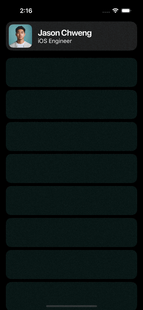

# Sticky Header Profile



A dynamic sticky header that scales, adjusts text size, and morphs as you scroll - perfect for profile screens or contact cards.

## The Challenge

Create a header that sticks to the top while scrolling and smoothly transitions between two states: a compact card view and an expanded profile view with dynamic sizing and positioning.

## What I Learned

- **GeometryReader coordination** - Using coordinate spaces to track scroll position
- **Progress-based animations** - Calculating animation progress from scroll offset
- **Dynamic scaling** - Adjusting multiple properties (scale, font size, corner radius) based on scroll
- **Offset compensation** - Using `offsetX` to keep content aligned when sticky
- **Frame calculations** - Working with `minY` and `minX` to determine view position

## Key Features

- Header sticks to top on scroll
- Smooth scale transition (1x → 2x)
- Dynamic text sizing as you scroll
- Profile image corner radius morphs from rounded to circular
- Blur material background for glassmorphism effect
- Horizontal offset compensation keeps content aligned

## How It Works

The magic is in the GeometryReader calculations:
```swift
let minY = $0.frame(in: .named("scroll")).minY
let offset = max(-minY, 0)
let progress = max(min(offset / 100, 1), 0)  // Normalize to 0-1

// Dynamic properties based on progress
let scale = 1 + progress * 1                  // Scale 1x → 2x
let textSize1 = 23 - (progress * 2)           // Shrink main text
let imageRadius = 12 + (progress * 20)        // Round → Circle
let offsetX = max(-offset, -minX)             // Keep aligned
```

**Key concepts:**
- `minY` tracks vertical position in coordinate space
- `progress` is normalized (0 to 1) based on scroll distance
- Each property interpolates smoothly using `progress`
- `offsetX` compensates for horizontal drift when sticky

## Usage

1. Add a profile image to Assets named "profile"
2. Copy the file into your project
3. Use `StickyHeaderProfile()` in your view

**Customize:**
- Change profile name/title in the `HStack`
- Adjust `offset / 100` to control transition speed
- Modify scale multiplier (`progress * 1`) for different effects
- Replace the mint rectangles with your actual content

## Notes

This took some trial and error to get the offset calculations right. The tricky part was keeping the header aligned horizontally while it scales - that's what the `offsetX` calculation handles.

The debug overlay (opacity 0) was super helpful during development to visualize the math in real-time.

Built with Claude AI after exploring GeometryReader coordinate spaces and offset compensation techniques.

---

**Difficulty:** Intermediate  
**SwiftUI Concepts:** GeometryReader, CoordinateSpace, Dynamic Scaling, Scroll Tracking, Material Effects
